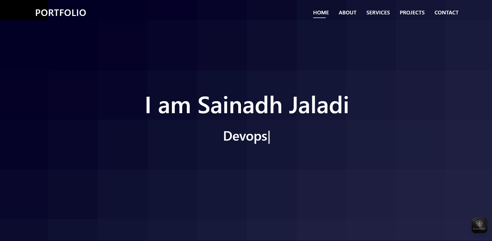

# 💼 Sainadh Jaladi - Developer Portfolio Website

Welcome to the source code of my **Personal Portfolio Website** built using the **DevFolio Bootstrap Template**. This website serves as a showcase of my projects, skills, experience, and contact information.

## 🌐 Live Website

Visit my portfolio here: [[https://sainadhjaladi.github.io](https://sainadhjaladi.github.io/MyPortfolioRepository/)](https://sainadhjaladi.github.io)

---

## 📁 About This Repository

This repository contains all the frontend source code for my personal portfolio site, which includes:

- `index.html` — The main landing page of the portfolio.
- `assets/` — Folder containing all images, CSS, and JavaScript files:
  - `css/` — Custom and Bootstrap CSS styles.
  - `img/` — Profile image, project screenshots, and icons.
  - `js/` — JavaScript files for animations and functionality.
- `README.md` — You are here!
- Other HTML pages (optional): About, Services, Portfolio, Contact, etc.

---

## ✨ Features

- Clean, professional UI with Bootstrap 5
- Fully responsive across all screen sizes
- Sections:
  - About Me
  - Skills
  - Projects
  - Contact
- Social media links (LinkedIn, GitHub, WhatsApp)
- Easy to update and customize

---

## 🛠 Technologies Used

- HTML5  
- CSS3  
- Bootstrap 5  
- JavaScript  
- Font Awesome  
- Google Fonts  

---

## 📷 Preview

